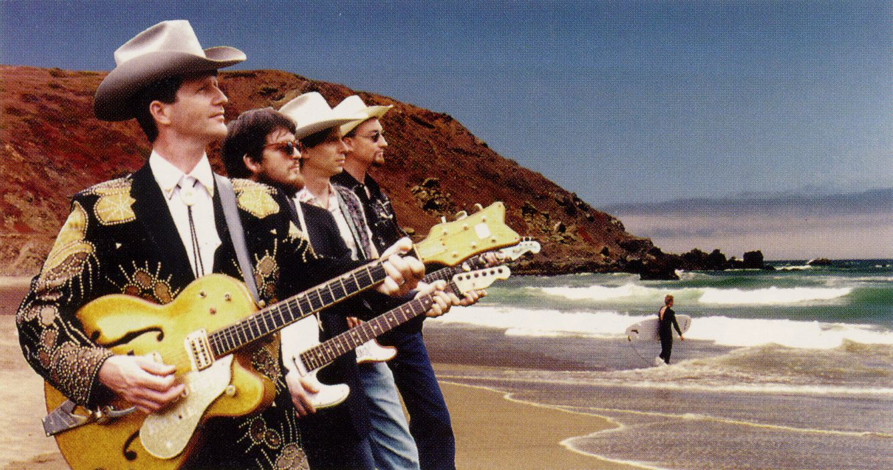

# VBE/AI SDK source code license terms

## For **portions** of VESA.C with separate copyright notices

Copyright (c) 1993 Jason Blochowiak, Argo Games. Used with permission.

## For the rest of the source code with a VESA (or V.E.S.A.) copyright notice

On April 5, 2021, Bill Lempesis <bill@vesa.org> wrote:

> *Volkert,* 
>  
> *VESA no longer supports this standard and it is in the public domain.  We have no objection to the sources in the SDK
> being published on GitHub. People may do with it as they wish.* 
>  
> *Bill* 

## For the FM timbres in the subfolder `MIDI/OPL2/TOOLS/`

FM timbres created by The Fat Man and Team Fat, Copyright 1993 The Fat Man(R). Feel free to use this in your projects,
as long as you include this copyright notice in the resulting software you publish. If you like my work, look for
remastered soundtracks under "The Fat Man and Team Fat," and please subscribe to me on social media:

* Bandcamp:  https://thefatmanandteamfat.bandcamp.com/
* YouTube:  https://www.youtube.com/user/TheMightyFatMan
* Twitter:  https://twitter.com/TheMightyFatMan
* Facebook:  https://www.facebook.com/TheFatManAndTeamFat
  
*On August 20, 1995, George wrote what we refer to as our "Manifatso."  Here it is.*

*Multimedia is a frontier for music. Along with the Internet, Multimedia will become important in a way that is
historically significant, for tremendous numbers of opportunities for, and different and new ways of listening to,
creating, and interacting with music.*

*As the settlers come to this frontier, it is incumbent upon us pioneers to make sure that this becomes a place that is
free and open for musical expression.  It is Team Fat's intention that the music in this place be expressive, touching,
and made for the sake of the human spirit, not repetitive, imitative, mechanical by convenience, nor needlessly enslaved
by styles imposed by fashion or limited machinery.*

*The musical precedents we set, and the tools we use and help create, the clothes we wear, the cars we drive, and the
things we say should all promote this vision.*

*[note: In January, 1995, there were 71 thousand internet domains. In January, 2007, there were over 433 million.
(source: Internet Systems Consortium). The Internet was still relatively new and computer games were classified as
"multimedia".]*

